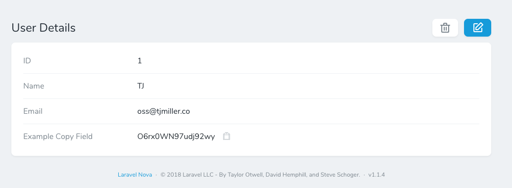
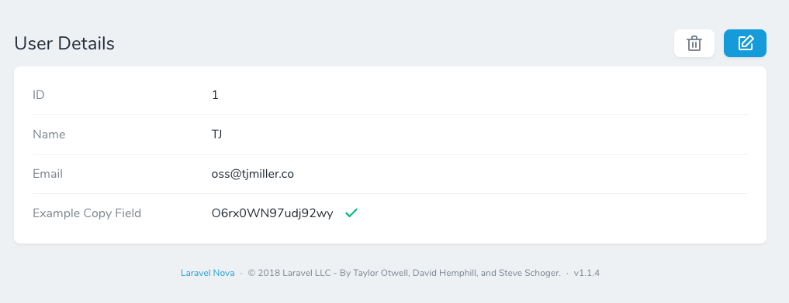
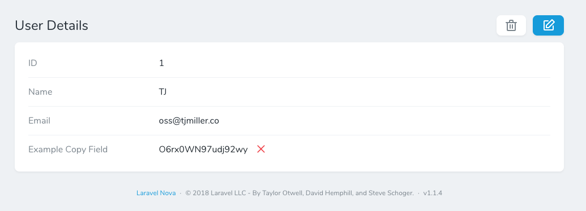

# Nova Text Copy Field

[](https://packagist.org/packages/sixlive/nova-text-copy-field)
[](https://packagist.org/packages/sixlive/nova-text-copy-field)
[](https://github.styleci.io/repos/152124692)

Laravel Nova text field with click to copy support. This field behaves just like a text field but adds the ability to copy the field value to your clipboard with just a click.

## Installation

```bash
> composer require sixlive/nova-text-copy-field
```

## Usage
Add the field to your resource.

```php
use Sixlive\TextCopy\TextCopy;

public function fields(Request $request)
{
    return [
        TextCopy::make('Example Copy Field', 'example_copy_field'),
    ];
}
```

## Screenshots
  
  
  

## Changelog
Please see [CHANGELOG](CHANGELOG.md) for more information on what has changed recently.

## Contributing
Please see [CONTRIBUTING](CONTRIBUTING.md) for details.

## Code Style
StyleCI will apply the [Laravel preset](https://docs.styleci.io/presets#laravel).

## Security
If you discover any security related issues, please email oss@tjmiller.co instead of using the issue tracker.

## Credits
- [TJ Miller](https://github.com/sixlive)
- [All Contributors](../../contributors)

## License
The MIT License (MIT). Please see [License File](LICENSE.md) for more information.
